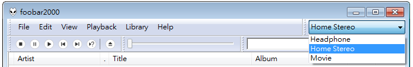
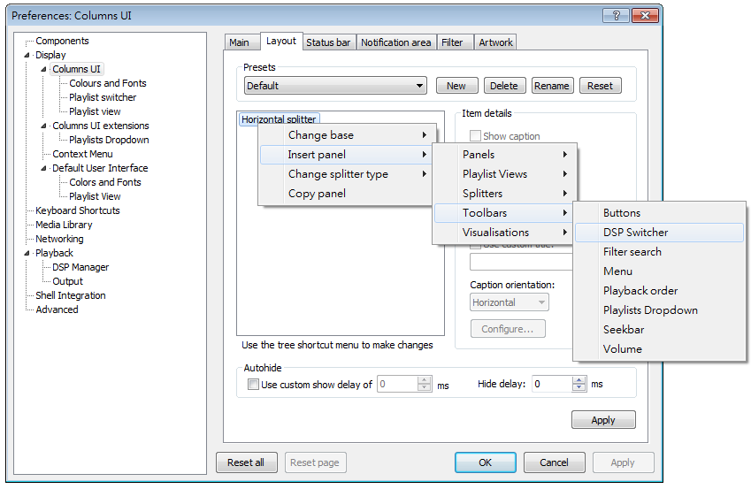
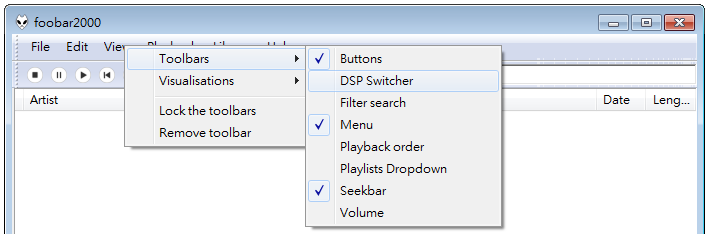

# foo_uie_dsp_switcher 

### Features
* A dropdown combo box to change DSP presets quickly 

### Download
[Releases page](../../releases)

### Usage
* Install [foo_ui_columns](https://www.foobar2000.org/components/view/foo_ui_columns) plugin
* To add `foo_uie_dsp_switcher`, right-click in Preferences, ColumnsUI layout: 
* Or right-click on menu bar: 
* If the list goes wrong after configuring DSP in Preferences, try restarting foobar2000. There is no easy way to retrive DSP preset names in the current foobar2000 SDK.

### Compiler
* Visual Studio 2015 Express

### License
See [LICENSE](./LICENSE) file

### Third-party code
* [foobar2000 Software Development Kit](https://www.foobar2000.org/SDK)
* [Columns UI SDK](https://github.com/reupen/columns_ui)

### References
* [foobar2000](https://www.foobar2000.org/)
* [foobar2000 forum](https://hydrogenaud.io/index.php/board,28.0.html)
* [Columns UI homepage](https://yuo.be/columns_ui)
